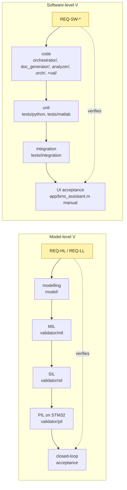

# BMS Engineering Assistant

Model-based design + AI fault prediction for an EV battery management system,
validated end-to-end via MIL → SIL → PIL on an STM32 Nucleo-H7A3ZI-Q.

## V-model

The project runs two parallel V-models against the same requirement
catalogue:



Per-requirement test mapping and verdict-figure conventions are in
[docs/v_model_audit.md](docs/v_model_audit.md).

## Project layout

```
bms-engineering-assistant/
├── ai/                          # data prep, training notebooks, ONNX import
├── model/
│   ├── plant/                   # 96s1p ECM-2RC + thermal Simulink models
│   ├── bms/                     # bms_master, bms_slave
│   ├── fault_predictor/         # LSTM dlnetwork + ONNX importer
│   └── system/
│       ├── system_model.slx     # closed-loop plant + BMS
│       └── params/init_system.m # SINGLE source of truth for all parameters
├── validator/
│   ├── +val/                    # shared helpers (sim_model, signal, check, ...)
│   ├── +fp/                     # fault-prediction trip baseline + injection
│   ├── requirements/            # requirements.json (REQ-LL-* catalogue)
│   ├── reports/                 # MIL/SIL/PIL JSON run reports
│   ├── mil/+mil/                # mil.run, mil.plant_convergence
│   ├── mil/tests/{plant,bms,predictor}/
│   ├── sil/+sil/                # sil.build, sil.run
│   ├── sil/tests/
│   ├── pil/+pil/                # pil.configure, pil.build, pil.run
│   ├── pil/board/               # nucleo_h7a3zit_q.ioc
│   └── pil/tests/
├── startup.m                    # adds paths and runs init_system.m
├── setup_project.m              # one-time createProject helper
└── Bmsengineeringassistant.prj  # MATLAB project file
```

## Engineering Assistant UI

Launch the App-Designer-style UI from MATLAB after `startup`:

```matlab
bms_assistant
```

Three tabs:
* **Model**    — open `bms_master` / `bms_slave` / `fault_predictor` in
  Simulink for editing. *Reset to snapshot* restores the original `.slx`
  files from `model/.snapshots/*.slx.bak` (created on first edit).
* **Validate** — pick MIL/SIL/PIL/COV paths and a per-path scenario
  (subsystem group for MIL, flat for SIL/PIL), watch the live console
  + progress bar, then save the generated `FULL_REPORT.json` /
  `REPORT.html` from `doc_generator/reports/`.
* **Reports**  — browse past runs (timestamped), preview HTML in a
  browser, save HTML/JSON anywhere.

The UI calls the in-process MATLAB orchestrator `orch.run(...)` (see
`orch/+orch/`). For headless/CI use, the equivalent Python entry point
`python -m orchestrator` remains available.

## Running validation (CLI)

Open the project (or `startup` from MATLAB) and call:

```matlab
mil.run                          % all MIL suites: plant, bms, predictor
mil.run('suites', {'bms'})       % single suite
mil.plant_convergence            % plant-vs-measurement RMSE sweep

sil.run                          % builds bms_master ert.tlc + runs sil tests
sil.run('skip_build', true)      % reuse existing slprj cache

pil.run                          % flashes Nucleo-H7A3 and runs pil tests
pil.run('skip_build', true)      % reuse existing PIL build
```

All tests write JSON to `validator/reports/`. Each run produces a timestamped
file `<TIER>_<run_id>.json` and a sticky `<TIER>.json` (latest run).

## Requirements traceability

Tests are named `test_REQ_LL_<COMPONENT>_<FUNCTION>_<NN>.m` and tag their
result struct with the matching `REQ-LL-*` ID from
[validator/requirements/requirements.json](validator/requirements/requirements.json).

| Suite     | Tests | Coverage                                       |
| --------- | ----- | ---------------------------------------------- |
| plant     | 3     | V_pack / SoC_pack / T_pack RMSE vs measurement |
| bms       | 24    | VMON, TMON, IMON, FSM, SOC, SOH, BAL, THM, PWR, WDG, AGG, PRD, HWP |
| predictor | 5     | OT/OV/UV lead-time, per-class DR, FAR          |
| sil       | 1     | bms_master MIL/SIL signal equivalence          |
| pil       | 3     | bms_master WCET, RAM footprint, LSTM prob_3 PIL/MIL match |

## Hardware

- MCU: STM32 Nucleo-H7A3ZI-Q (Cortex-M7 @ 280 MHz)
- PIL transport: Serial via ST-Link VCP (`COM3` on the dev PC, override
  in `validator/pil/+pil/configure.m` if different)
- WCET measurement: Embedded Coder code-execution profiling sampled by the
  free-running 32-bit TIM5 counter (1 tick = 3.57 ns). HAL TimeBase runs
  on TIM7 to avoid a clash, NVIC priorities (USART3=0, DMA=0, TIM7=15)
  keep the PIL serial responsive. After skipping a warmup window the max
  warm-step time over ≥ `req.RT_WCET_min_steps` is gated against
  `req.RT_WCET_max_us`. See `validator/pil/tests/test_REQ_LL_RT_WCET_01.m`.

## Parameters

All thresholds, debounces, lookahead horizons, thermal setpoints and
balancing currents are defined in
[model/system/params/init_system.m](model/system/params/init_system.m). Tests
read them via `evalin('base', 'bms')` / `evalin('base', 'predictor')` — there
are no magic numbers in the test files.
